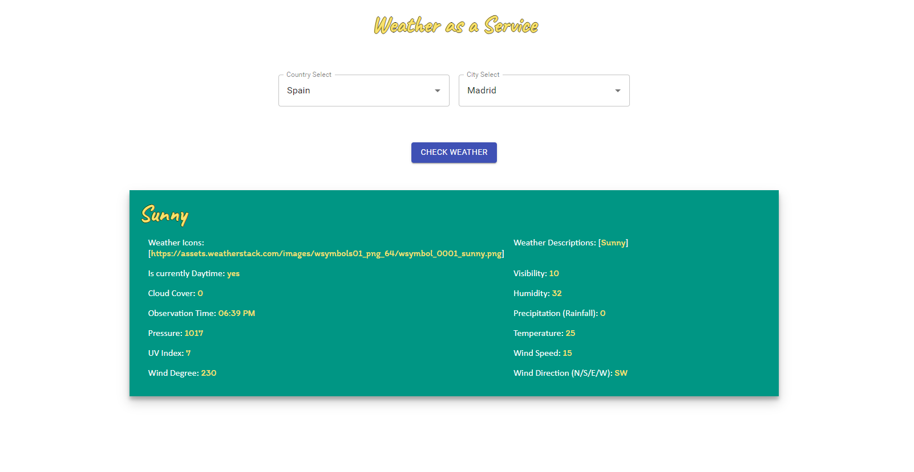

# Weather-As-A-Service
A simple web application that allows the user to fetch the current weather for a city. This application also exports a public RESTful API for client-query.

### Date
17th of May, 2021

### Location of deployed application
https://weather-as-a-service-app.herokuapp.com/

### Time spent
Core Goal of developing a Rest API: ~1 hour  
Finding real country/city/weather APIs to integrate with: ~1 hour  
Build simple UI: ~2 hours  
Deploying the application: ~2 hours (Springboot/React/Webpack project deployment on Heroku) - This took me some time 
to get the configuration correct.

### Assumptions made
N/A

### Shortcuts/Compromises made
The API that I am using to get country and city information is a little finicky you may find if you try certain 
countries/city combinations. I would have integrated with a better API for data quality and greater service reliability
otherwise! Sometimes you may notice if you select a certain country, that the cities won't be found - this is just a data issue
on their end.

### Stretch goals attempted
- Created a simple UI, with React/Typescript/Webpack and node.
- Deployed the application with the link in the readme.
- Proxied a real weather API for my service (http://api.weatherstack.com, however this is limited per month on the free-tier).

I did not add authentication to the interface for this project.

### Instructions to run assignment locally

**Curl**  
Get All Countries: `curl -X GET "http://weather-as-a-service-app.herokuapp.com/api/countries"`  
Get Cities By Country Name: `curl -X GET "http://weather-as-a-service-app.herokuapp.com/api/cities?country=canada"`  
Get Weather By City Name: `curl -X GET "http://weather-as-a-service-app.herokuapp.com/api/weather?city=Vancouver"`  

**Local**  
- Ensure you maven installed on your system.
- You should then be able to clone the project from Github.
- Go to the root directory of the project where the `pom.xml` is located and type `maven clean install`.
- You should then be able to `cd` into the generated `target/` folder and find the .jar file.
- It is required that an API key from [http://api.weatherstack.com] is specified in the vm options of the jar execution, this will look like as follows:
`java -Dweather-api-access-key=YOUR_KEY_HERE -jar [app-name].jar`

### What did you not include in your solution that you want us to know about?
I would have completed the authentication stretch goal using spring-security. Also, perhaps would have found a better 
country/city API to integrate with for this project, for data quality and robustness.

### Other information about your submission that you feel it's important that we know if applicable.
### Your feedback on this technical challenge
It was definitely a good task! I'm quite familiar with doing this type of work so  
I tried to focus on some new skills I could pick up, IE Styled Components. 
